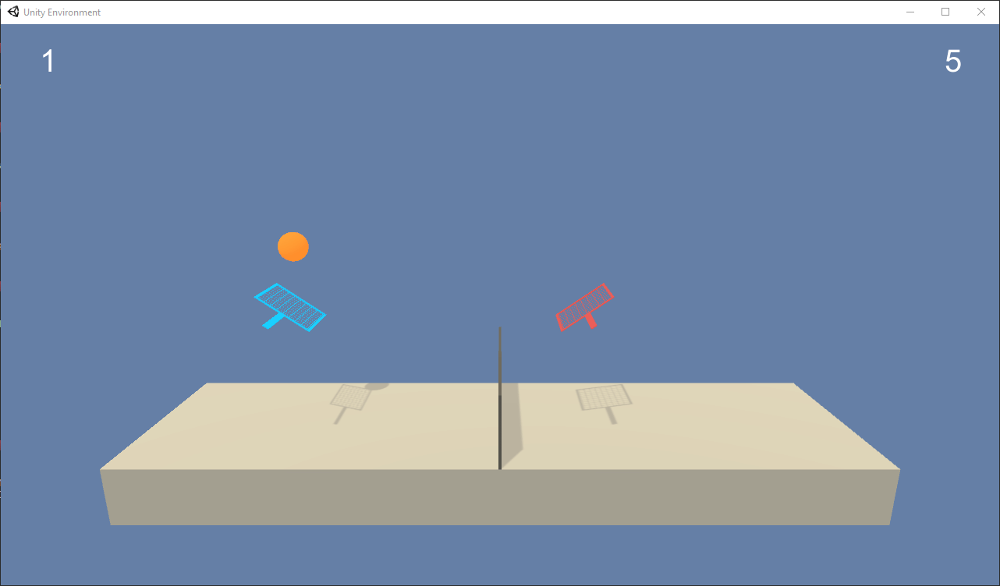
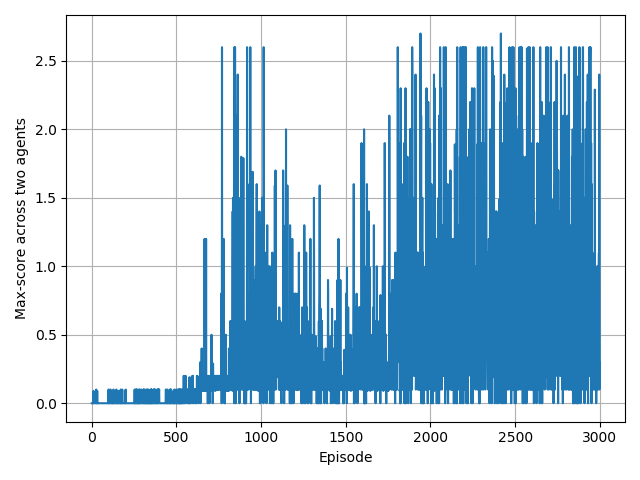
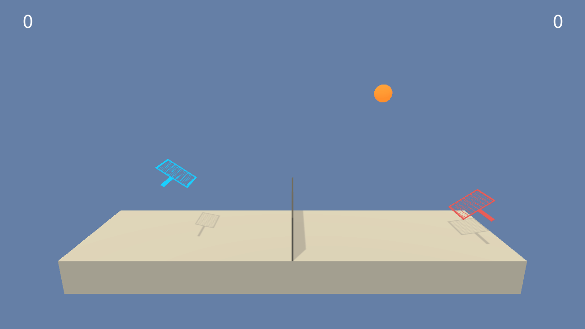

# Report

Prior to any training, the agents perform random actions and do not try to keep the ball in play. This is shown in the animation below.

## Learning Algorithm
* The algorithm used is the [DDPG algorithm](https://arxiv.org/abs/1509.02971) proposed by Lillicrap et al.
* Both rackets have an identical goal and action-space. It is therefore sufficient to learn a single actor-critic model, using a shared replay buffer, that is applied to both agents in order to solve this environment.
* DDPG is a model-free, off-policy policy gradient based learning algorithm that is based on using Deep Neural Networks as nonlinear function approximators and particularly suited for learning policies that maximize reward for solving problems involving continuous action spaces.
* DDPG is an Actor-Critic approach in that two models are used to effectively learn the best policy. An Actor deep neural network is used to approximate the optimal policy i.e. at any state, it returns a probability distribution over the set of possible actions; the Critic is used to approximate the action value function i.e. for any given (state, action) pair, the Critic returns the associated Q-value. 
* To learn **each** of the Actor and Critic models, two models are maintained just like in the Deep Q-learning (DQN) approach [see earlier project p1_navigation](https://github.com/lshrihari/deepRL/tree/master/p1_navigation) - the local and target neural network models. The target has its weights set to a previous weight of the local model; the local model is trained continuously given the target's response to the environment interaction experience of the agent. The same approach is used to learn the Critic.
* The DDPG also bears strong similarities with the DQN in that it leverages concepts like the use of the Replay Buffer, introduced in DQN.

## Model and hyperparameters

* Experiments suggested the simpler (than the paper) neural network having two hidden layers of 256 and 128 units performed sufficiently well to solve this task.
* Post experimentation, the final hyperparameters used were
  * Replay buffer size = 1e6
  * Soft update parameter $\tau$ = 1e-3
  * Batch size = 128
  * Learning rates for both Actor and Critic = 1e-3
  * L2 Weight decay = 0
  * Discount factor for computing expected return $\gamma$ = 0.99

## Outcome

* A successful training outcome is available in the "saved" folder. It includes model weights and average scores obtained. The plot of the average scores is provided below. The environment was solved in 888 episodes when it obtained an average reward (over 100 episodes) of 0.51; training was however continued to 3000 episodes to further improve the agent's skills - model weights were only saved when the average reward was better than any previously recorded outcome (that is already above 0.5). The maximum average reward obtained over the entire run was 0.90 .
* The maximum of the scores of the two agents obtained in each episode of training is shown in the plot below.

* Post training, the agents chase the ball and act towards keeping the ball in play. Note the length of a single rally in the animation below.

## Improving this work

* Network structure and hyperparameter tuning was a manual, time-consuming and frustrating process. Automated structure and hyperparameter selection even through a brute-force grid-search based approach and ideally, through optimization of a surrogate of the loss function would be very helpful.

* Testing different algorithms like PPO, A3C and D4PG to compare and contrast with DDPG would help.

* Testing a harder problem such as the [Soccer](https://github.com/Unity-Technologies/ml-agents/blob/master/docs/Learning-Environment-Examples.md#soccer-twos) environment would be an interesting next step.